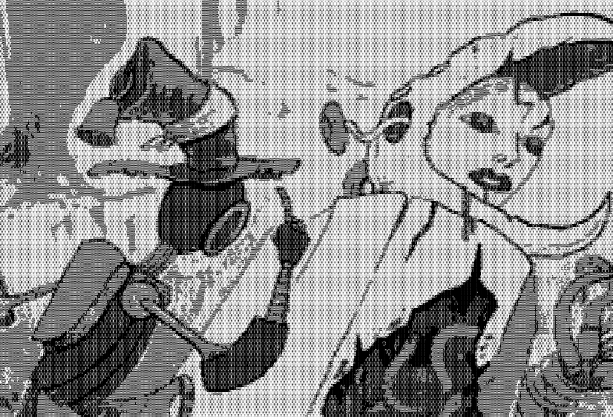

# Enkelt Google Translate översatt Troika! RPG

Men först några villkor först:

# Terms

Anyone may publish free or commercial material based upon and/or declaring compatibility with “Troika!” without express written permission from the publisher, the Melsonian Arts Council, as long as they adhere to the following terms:

If your product declares compatibility with Troika! you must state the following in your legal text and on any websites from which a commercial product is sold: “[product name] is an independent production by [publisher name] and is not affiliated with the Melsonian Arts Council.”

The Melsonian Arts Council takes no responsibility for any legal claims against your product. 

The mechanics and concepts of “Troika!” may be reused freely. 

The text of “Troika!” may not be used verbatim.

All artists maintain copyright of their work.  

# Gå vidare till reglerna i sidan :)
